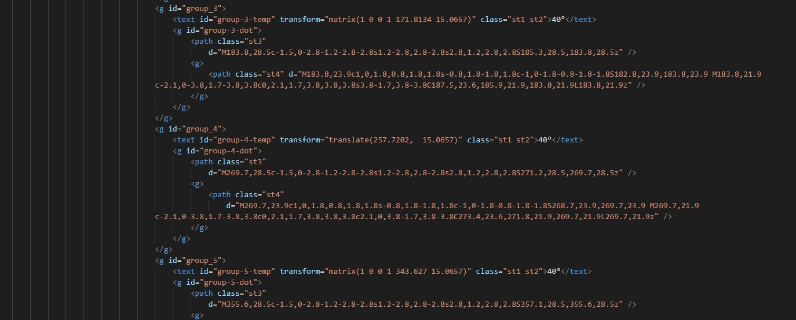

# Procesverslag
**Auteur:** Sasja Koning

Markdown cheat cheet: [Hulp bij het schrijven van Markdown](https://github.com/adam-p/markdown-here/wiki/Markdown-Cheatsheet). Nb. de standaardstructuur en de spartaanse opmaak zijn helemaal prima. Het gaat om de inhoud van je procesverslag. Besteedt de tijd voor pracht en praal aan je website.

## Bronnenlijst

Al mijn gebruikte bronnen staan direct in de code.

1. -bron 1-
2. -bron 2-
3. -...-

## Intake (week 1)

**Je startniveau:** Zwarte piste

**Je focus:** Beide, in eerste instantie Surface.

**Je opdracht:** Nabouwen Weather app van android MIUI

**Screenshot(s):**

**Breakdown-schets(en):**

## Eindgesprek (week 7/8)

Voor mijn eindgesprek was het mij helaas niet gelukt om optijd de code voor de 2e pagina af te krijgen. Ik had inplaats daarvan een extra pagina gemaakt die verder weinig interactie had. Ik baalde flink dat ik mijn werk niet goed af kon krijgen en had van te voren al besloten om verder aan de website te werken voor de herkansing. Verder waren er een aantal dingen die ik nog moest verbeteren volgens Robert tijdens het eindgesprek:

- De website is nog niet helemaal af
- De code kan hier en daar wat netter
- Onderzoek doen naar Stylelint en Eslint
- Procesverslag toevoegen
- Pagina's afmaken zoals origineel gepland was

Deze feedback heb ik in de week na het eindgesprek verwerkt.

- Ik heb mijn code netjes en consistent gemaakt
- Ik heb alle pagina's afgemaakt
- Op de forecast pagina worden de temperaturen en iconen random gegenereerd
- Voor de forecast pagina heb ik een stukje code geschreven die de dag van de gebruiker ophaald en die dagen dan correct op de goede plek neerzet in de table
- De wind-richting iconen op de forecast pagina hebben nu een random richting per reload
- de sun-rise/sun-down animatie op de index pagina werkt nu realistisch op basis van de tijd van de gebruiker. Dus wanneer het 20:00 is voor de gebruiker zal de zon verder staan dan om 8:00.

**Screenshot(s):**

-screenshot(s) van je eindresultaat-

## Voortgang 3 (week 6)

Ook deze feedback ronde was met een student assistent. Hij wees mij erop om nog wat meer te letten op het opruimen van mijn code en het wegwerken van errors. Op dit moment had ik nog niet de code voor de tweede pagina af. 

Met hulp van Robert, mede-studenten en mijn broer heb ik een deel van de javascript succesvol kunnen schrijven. Het lukte mij om één van de temperaturen random aan te passen. Nu moest er voor zorgen dat dit voor alle temperaturen zou werken. Dit kon nog complex worden met switches en forEach.

## Voortgang 2 (week 5)

Bij deze feedback ronde heeft een student assistent gekeken naar mijn code. Hierop vertelde hij mij dat ik wat meer moest gaat letten op mijn class gebruik.

Wat ik zelf graag nog wou verbeteren was de css en javascript. vooral de css was rommelig geschreven en ik had geen css reset gebruikt waardoor ik vaak moest spelen met margins en padding.
Met javascript wilde ik graag aan de slag met de tweede pagina waar ik verschillende temperaturen dynamisch zou genereren. Van Robert had ik de tip gekregen om dit met svg's te doen. Werken met svg code is best complex dus ik had er wel af en toe wat moeite mee. Achteraf zou het resultaat wel super tof zijn.

## Voortgang 1 (week 3)

Voor de eerste feedback ronde had ik al een groot deel van mijn eerste webpagina af. Ik had alle html geschreven en een boel dingen al in css gedaan.
Wat nog miste waren een aantal iconen die ik in illustrator zou maken en wat positie dingetjes die beter konden. Ik was ook al bezig geweest met javascript.
Ik had een animatie gemaakt met Lottie.js en een aantal iconen random laten bewegen per page refresh.

**Screenshots van website:**

## Bronnen
