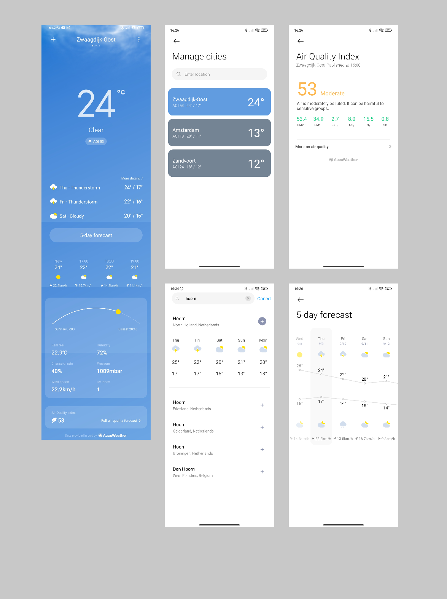
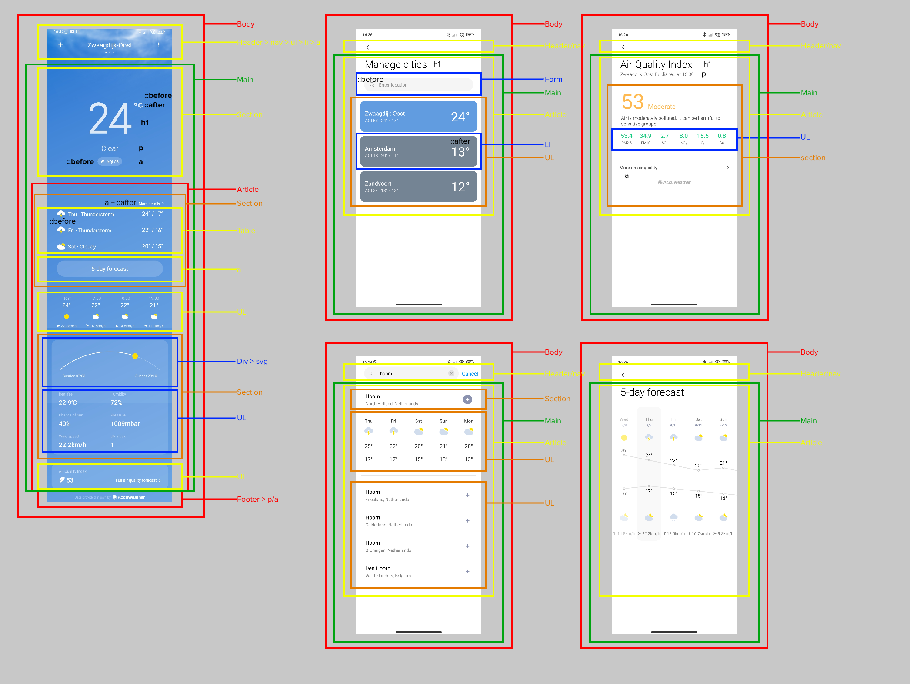
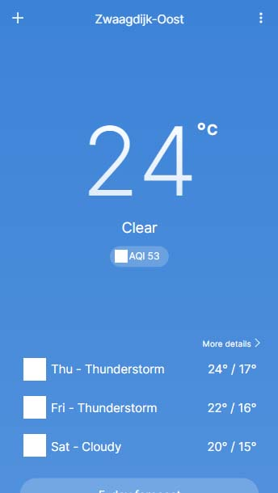
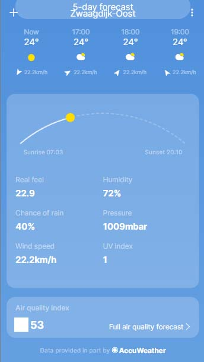

# Procesverslag
**Auteur:** Sasja Koning

Markdown cheat cheet: [Hulp bij het schrijven van Markdown](https://github.com/adam-p/markdown-here/wiki/Markdown-Cheatsheet). Nb. de standaardstructuur en de spartaanse opmaak zijn helemaal prima. Het gaat om de inhoud van je procesverslag. Besteedt de tijd voor pracht en praal aan je website.

## Bronnenlijst

Al mijn gebruikte bronnen staan direct in de code.

1. -bron 1-
2. -bron 2-
3. -...-

## Intake (week 1)

**Je startniveau:** Zwarte piste

**Je focus:** Beide, in eerste instantie Surface.

**Je opdracht:** Nabouwen Weather app van android MIUI

**Screenshot(s):**

**Breakdown-schets(en):**

## Eindgesprek (week 7/8)

-dit ging goed & dit was lastig-

**Screenshot(s):**

-screenshot(s) van je eindresultaat-

## Voortgang 3 (week 6)

Ook deze feedback ronde was met een student assistent. Hij wees mij erop om nog wat meer te letten op het opruimen van mijn code en het wegwerken van errors.

## Voortgang 2 (week 5)

Bij deze feedback ronde heeft een student assistent gekeken naar mijn code. Hierop vertelde hij mij dat ik wat meer moest gaat letten op mijn class gebruik. 

## Voortgang 1 (week 3)

### Stand van zaken

Voor de eerste feedback ronde had ik al een groot deel van mijn eerste webpagina af. Ik had alle html geschreven en een boel dingen al in css gedaan.
Wat nog miste waren een aantal iconen die ik in illustrator zou maken en wat positie dingetjes die beter konden. Ik was ook al bezig geweest met javascript.
Ik had een animatie gemaakt met Lottie.js en een aantal iconen random laten bewegen per page refresh.

**Screenshots van website:**

