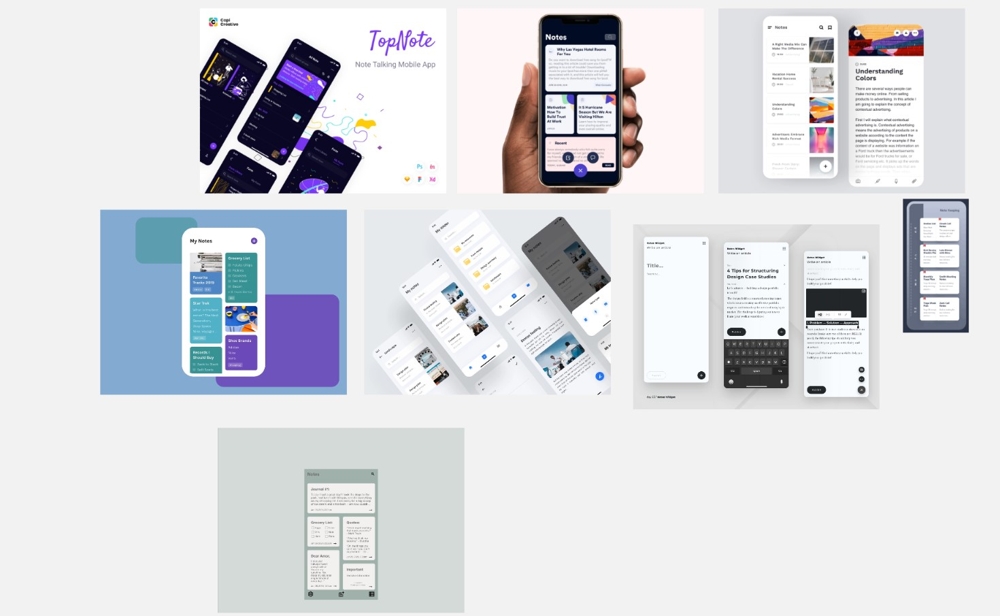

# Procesverslag
**Auteur:** Sasja Koning

Markdown cheat cheet: [Hulp bij het schrijven van Markdown](https://github.com/adam-p/markdown-here/wiki/Markdown-Cheatsheet). Nb. de standaardstructuur en de spartaanse opmaak zijn helemaal prima. Het gaat om de inhoud van je procesverslag. Besteedt de tijd voor pracht en praal aan je website.

## Bronnenlijst
1. -bron 1-
2. -bron 2-
3. -...-

## Eindgesprek (week 7/8)

-dit ging goed & dit was lastig-

**Screenshot(s):**

-screenshot(s) van je eindresultaat-

## Voortgang 3 (week 6)

-same as voortgang 1-

## Voortgang 2 (week 5)

-same as voortgang 1-

## Voortgang 1 (week 3)

### Stand van zaken

-dit ging goed & dit was lastig-

**Screenshot(s):**

-screenshot(s) van hoe ver je bent-

### Agenda voor meeting

-samen met je groepje opstellen-

### Verslag van meeting

-na afloop snel uitkomsten vastleggen-

## Intake (week 1)

**Je startniveau:** Zwarte piste

**Je focus:** Beide, in eerste instantie Surface.

**Je opdracht:** Zelf ontworpen notitie app. Hierbij wil ik dat de gebruiker notities, to-do lijsten kan toevoegen. Ook wil ik dat de gebruiker notities kan bookmarken/highlighten en kan verwijderen. Met dit project wil ik graag leren hoe ik door de gebruiker gecreëerde elementen kan opslaan zodat hij/zij deze later kan terug zien.

**Screenshot(s):**

**Breakdown-schets(en):**

